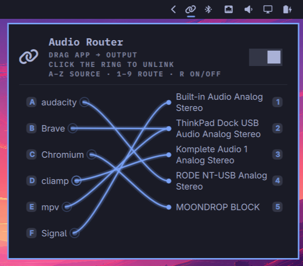

# Audio Router

Persistent per-app audio routing for the Omarchy shell. A dedicated bar icon
opens a two-column patchbay; drag any app onto any output (or click-click) to
route it. Pinned routes live on disk and are reasserted continuously, so a pin
made while an app is silent kicks in the moment that app starts playing — and
survives reboots.



## Highlights

- **It sticks.** Pinned routes are reasserted continuously and survive reboots,
  so a pin you made while an app was silent applies from the first moment it
  plays.
- **Route by eye, not by ID.** One row per app, real output names shown in
  full, no raw PipeWire node strings — drag, click, or type.
- **Tune up before the call.** Every app is listed whether or not it is playing,
  so you can pre-pin the whole desk before any audio starts moving.
- **Keyboard-native.** Every row carries its shortcut: a letter picks the app,
  a number routes it, `r` toggles routing on and off.
- **Bluetooth that behaves.** Rules follow the device rather than the profile,
  so reconnects don't drop you to the laptop speakers, and disconnects return to
  the default output instead of muting into a vanished headset.
- **Private by design.** No network connections, no telemetry. Your pins live in
  two local files you can wipe with `--purge` (see *Privacy and data*).

## Requirements

- Omarchy shell (uses `omarchy`, `quickshell`, `jq`)
- `pactl`, `python3`
- `bluetoothctl` *(optional)* — only to show a friendly name for a paired
  Bluetooth device; without it the plugin falls back to the name PipeWire
  reported, then to `Bluetooth AA:BB:CC:DD:EE:FF`

## Install

```sh
./install.sh          # install + enable widget (the running install is backed up first)
```

Re-installing over a newer version never clobbers it: the current plugin dir is
copied to `.petealeon.router.bak.<timestamp>` next to the plugins folder (the 3
newest backups are kept).

Upgrading from the old `peter.router` id needs no manual step — just run
`./install.sh`. The installer notices the superseded id, stops its watcher,
unregisters the old plugin (which also removes its bar entry) and re-adds the
widget under `petealeon.router` in the same right-hand section. Your routing
rules in `~/.config/omarchy/router-rules.json` are never touched by the rename.

## Uninstall

```sh
./install.sh --remove   # removes the widget; routing rules are kept
./install.sh --purge    # removes the widget, the routing rules, and the state file
```

Note: `omarchy plugin remove` alone leaves `router-rules.json` in place by
design, so a reinstall restores your pins. `--purge` also deletes
`petealeon-router.json`, which holds the on/off preference and the cached
Bluetooth device names — deleting it is how you clear that history.

## Usage

Click the link icon (right side of the bar) to open the patchbay, or press your
bar's panel hotkey — see *Keyboard*.

- **Route:** drag an app row onto an output column.
- **Reset to default:** drag onto the current default output row or click the
  ring beside the app's name.
- **Live sources:** a source with an active stream draws its circle and name
  at full weight; idle apps are dimmed. The circle/ring stays the pin signal —
  accent when the app is routed to one of your outputs.
- **Where things are:** a source's circle sits directly after its name rather
  than at a fixed spot down the column, so a short name keeps its circle next to
  it. An output name is shown in full over two lines instead of being cut short —
  the tail of `RODE NT-USB Analog Stereo` is the part that says what it is, and
  an ellipsis is exactly where that would go.
- **Routing on/off:** the header switch (like other Omarchy tools) turns routing
  on and off. Off moves every stream back to the system default output and stops
  re-asserting; saved rules are kept, so switching back on re-pins the same apps.
  While off the patch dims and any route you set is only *stored* — it draws as
  a dashed line with no endpoint dot, and the stream stays where it is until the
  switch comes back on. Resets still apply immediately, since "everything is
  already on the default" is what off means.

Every audio client is listed, whether or not it is playing right now — the left
column is a stable set you can pre-pin, not a live activity feed; rows with an
active stream draw at full weight, idle ones are dimmed. System services
(quickshell, wireplumber, pipewire, the portals, EasyEffects) are never listed
and never steered, so there is nothing to pre-pin *of those* and nothing that
can be dragged by accident.

## Keyboard

The panel opens like any other bar widget: click the link icon, or press your
bar's panel hotkey (in Omarchy the bindings are listed as `Bar panel N`, e.g.
`SUPER + CTRL + 1`). If you'd rather not depend on bar order, bind your own key
to `omarchy-shell shell toggle petealeon.router`.

Once open the panel is fully drivable without a mouse. The first arrow press only
wakes the cursor — it does not move or scroll, so the panel never jumps on a
stray keypress.

### Quick routing

Routing straight from the keyboard is a two-step pick, and every row shows its
shortcut on the badge: an app row carries a letter, an output row a number
(`1`–`9`, then leftover letters for outputs past #9).

1. Press the **letter** of the app you want to route — it highlights and stays
   selected.
2. Press the **number** (or letter) of the output to send it there.

There is no modifier and no mode to arm: the badges are always visible, a letter
means either a source *or* an output (never both, because sources claim the
alphabet first), and you can chain as many routes as you like —
`a` `1` `b` `1` `c` `2` — before closing.

Routing on/off is `r`, matching the mnemonic-letter convention the built-in
Bluetooth (`b`), Wi-Fi (`w`) and Tailscale (`t`) panels use.

| Key | Action |
| --- | --- |
| `j` / `Down`, `k` / `Up` | Move the cursor a row. From the first app row, up enters the header; from the header, down returns to the app list |
| `l` / `Right` | From an app row: jump to the output it is connected to, ready to re-route |
| `h` / `Left` | Back to the app row from the output column |
| `Return` / `Space` | On the header: toggle routing. On an output: route the app to it |
| `x` | Reset the app to the system default (same as clicking its ring) |
| `a`–`z` | Select the app with that badge — quick routing's first step. Letters `j k h l x` (movement/delete) and `r` (routing) are reserved, so no row bears them |
| `1`–`9` | Route the selected app to that output — quick routing's second step. With no app picked first it uses the app under the cursor (from the header, the last app it sat on); an output's letter badge works the same as its number |
| `r` | Toggle routing on/off, from anywhere in the panel |
| `Tab`, `Shift+Tab` | Next / previous panel |
| `Escape` | Close |

The cursor spans both columns, so moving right lands on the output the app is
currently on and left comes back to where it was. Both columns' rows share one
height, so a source and the output beside it stay on the same line.

## Bluetooth devices

- **Disconnects fall back cleanly.** If a pinned device goes away (e.g. a
  headset powers off), the next poll moves its streams to the *system default*
  instead of leaving them muted on the vanished device — and the rule is kept,
  so when the device returns the streams are routed back and the pin is intact.
- **Rules follow the device, not the cable.** PipeWire renumbers Bluetooth
  profile indices between reconnects, so matching by name alone would read a
  re-indexed headset as "gone" and drop it to your speakers. Rules therefore
  match the device itself and survive a re-pair or profile change in either
  direction; wired outputs are still matched exactly. A device that is present
  under a different index is not shown as a second, disconnected row.
- **Names survive power-off.** A disconnected Bluetooth output is still listed
  by its name (remembered from the last time it was seen) rather than a raw
  `bluez_output…` id. See *Privacy and data* for what that involves.

## Privacy and data

The plugin is local-only. It makes no network connections, and nothing is sent
anywhere. It reads `pactl` output and writes exactly two files, both under
`~/.config/omarchy/`, both created mode `0600`:

| File | Contains | Written by |
| --- | --- | --- |
| `router-rules.json` | Your pins: app/binary/node identity and the raw output name each is pinned to | you, by pinning |
| `petealeon-router.json` | The routing on/off preference, and a cache of **Bluetooth device names and MAC addresses** | the helper, from BlueZ |

`bluetoothctl` is an **optional** dependency used only to turn a MAC address into
a human-readable device name. If it is not installed the plugin still works: it
falls back to the name PipeWire reported while the device was connected, and
then to `Bluetooth AA:BB:CC:DD:EE:FF`. The lookup result is cached (asked once
per device), and the cache survives disconnects — which is the entire point,
since the sink is gone from `pactl` exactly when you want to see the name.

Because the state file holds device names and MACs, treat it as identifying
information: it is `0600`, and `./install.sh --purge` removes it. No other
identifier, hostname, or telemetry is collected, and the two files are never
transmitted.

---

The rest of this file is for people building on or debugging the plugin. If you
only use it, you can stop here.

# For developers

## Component layout

- **Bar widget:** `petealeon.router` (BarWidget.qml + Panel.qml + Model.js)
- **Watcher/helper:** `assets/omarchy-router` (pure-python, no dependencies
  beyond `pactl`; `bluetoothctl` optional — see *Requirements*)
- **Rules store:** `~/.config/omarchy/router-rules.json`
- **State:** `~/.config/omarchy/petealeon-router.json` (on/off preference and cached
  Bluetooth device names — see *Privacy and data*)

## How routing is matched

Rules are matched per stream in order of specificity:

1. process-binary basename (e.g. `brave`, `mpv`)
2. PipeWire `node.name` basename
3. `application.name`, with a trailing `" input"` ignored
4. the application named inside a `PipeWire ALSA [app]` wrapper

Browser streams often carry a stable `node.name` but no reliably unique binary
per process, so the node key keeps Brave/Signal rules matching. An app is the
*set* of names its records answer to, and two records are the same app when those
sets intersect at all — which is what makes the fourth identity the one that
matters: a rule written as `cliamp` has to find the stream PipeWire named
`PipeWire ALSA [cliamp]` and knows nothing about, and vice versa. System services
(EasyEffects, Quickshell, wireplumber, pipewire, systemd, the portals) are never
steered.

`set-sink` de-duplicates by identity (not just key), so re-pinning an app whose
`process.binary` only became visible after the first pin still replaces the old
rule instead of creating a second one.

The panel lists **one row per app**, not per key. An app can be named three
different ways at once — PipeWire reports the ALSA client of a program as a
stream with no `process.binary` at all, so that row is keyed by `node.name`
while the client and any pin on it are keyed by the binary. Rows are therefore
folded by identity: a stream and a pin that share any one of those names become
a single row, and a pinned row is keyed by its pin so its identity does not
follow a node name that changes. Two unrelated apps that happen to share a name
stay separate.

A pin left over from an older version that names an internal node — the kind the
first-word rule used to let through — is not shown. It could not be honoured
anyway, since the helper refuses to steer a stack name, and drawing it would
leave a pin you can neither trust nor explain, holding a phantom output row open.
The rule itself stays in `router-rules.json` until you remove it by name, so
nothing is discarded behind your back.

`PipeWire ALSA [x]` is PipeWire's wrapper for the ALSA client of an application,
and **`x` is that application** — on a machine with the terminal music player
[cliamp](https://github.com/bjarneo/cliamp) installed, that is what the row is.
Such an app is listed, labelled `cliamp`, and routable like any other. The stack
is excluded by exact, tag-stripped name only — `pipewire` itself, the session
manager, the portals, `quickshell`, `systemd`, `EasyEffects` and this plugin's
own tooling — with no first-word or namespace rule that could quietly swallow
an application you installed.

To drop a pin, name the app as the panel shows it:

```sh
python3 assets/omarchy-router remove cliamp
```

## Watcher behaviour

- Polls every 0.5s while audio is playing and backs off to 2.5s when the session
  is silent, applying rules either way and exiting when its spawning parent is
  gone. The fast cadence only matters when a stream can start out on the wrong
  output, which is when something is playing; it lingers for a few seconds after
  the last stream so a pause between tracks does not drop to the slow cadence and
  miss the next one. Watcher log:
  `$XDG_RUNTIME_DIR/omarchy-router.watch.log`, capped at 256 KB with one previous
  generation kept.
- **Never steers the audio stack:** the exclusion list is applied case- and
  suffix-insensitively (`WirePlumber`, `wireplumber` and `WirePlumber [client]`
  are all refused) and matches on the process binary as well as the reported
  name, so a session-manager stream cannot be moved by the watcher or by
  `restore`.
- **The on/off switch is enforced where the move happens:** the watcher reads
  the preference itself, so a stray or manually started watcher cannot steer
  anything the user has switched off. It idles rather than exiting, and costs one
  small file read per poll.
- **Singleton:** one watcher per shell via an `flock`; a shell or plugin reload
  can never spawn a duplicate.
- **Self-healing:** the widget restarts a crashed watcher (bounded, 3s delay,
  5 attempts per session), reflected in the header's routing switch. A manual
  restart resets the counter. Flock conflicts, SIGTERM teardown and clean exits
  are not counted as crashes: the watcher briefly waits out a stale lock holder
  on plugin reloads, retries a contended flock once, and otherwise re-arms
  quietly on a 30s timer — with a liveness backstop should the engine deliver
  no death event at all. Switching routing off stops the watcher completely; no
  timer re-arms it until the switch is turned back on.
- Manual start: `python3 assets/omarchy-router watch`
- `restore` is what makes "routing off" mean what it says: it takes the watch
  lock (bounded, so a just-stopped watcher finishes first) and moves every
  valid stream to `pactl get-default-sink`. Rules are never modified, so
  switching routing back on re-pins the same apps.

## CLI

```sh
python3 assets/omarchy-router list                              # full state as JSON
python3 assets/omarchy-router set-sink <app> <binary> <node> <sink|__default__>
python3 assets/omarchy-router set-rule <app> <binary> <node> <sink|__default__>
python3 assets/omarchy-router remove <app-or-binary>
python3 assets/omarchy-router restore                            # all streams back to the default sink
python3 assets/omarchy-router watch                             # poll watcher
python3 assets/omarchy-router selftest                          # zero-I/O sanity checks
```

`set-sink` stores the rule *and* moves matching streams. `set-rule` only stores
it, which is what the panel uses while routing is off. Both take the same four
arguments, so the panel switches on one flag rather than maintaining two
different call shapes.

`selftest` exercises the parsers, matcher, fallback, store mutation, the
`set-rule`/`set-sink` split and the exclusion/cadence/log policies on canned
pactl output — no real pactl, no real store — and exits 0/1. Run it after a
deploy or in CI. The exclusion policy is written down once, in `Model.js`'s
`EXCLUDE_APPS`, and the selftest asserts that `Panel.qml` still holds no copy of
its own — a second list is exactly how the two drifted before. Both
implementations are held to the 32 cases in `scripts/exclusion-cases.json`, and
on the *rule* rather than on the names, because both sides once listed identical
names while still disagreeing about which to reject. An installed copy has no
`scripts/` directory and says so rather than reporting a silently weaker run.

## Development

- `./install.sh` is the only supported way to touch the live install; never edit
  `~/.config/omarchy/plugins/petealeon.router` directly.
- QML changes land in `BarWidget.qml` / `Panel.qml` / `Model.js`; the helper
  contract (`list` JSON shape, `set-sink` args) is shared with the panel.
- `assets/omarchy-router` selftest should stay green (or be extended) whenever
  the helper's parsing/matching changes. `cmd_watch` is an infinite loop that
  talks to real pactl, so its safety properties (the off-switch gate, the
  exclusion list, the cadence, log bounds) are asserted against the function's
  source text in the selftest — extend those checks when the loop changes.
- `./scripts/qml-lint.sh` runs `qmllint` over all three. It finds the binary
  itself (`qmllint` is not on `PATH` on Arch — it ships in `qt6-declarative` as
  `/usr/lib/qt6/bin/qmllint`; on Debian/Ubuntu install
  `qt6-declarative-dev-tools`) and builds the `qs.*` import shim from
  `/usr/share/omarchy/shell` so the omarchy types resolve. It exits non-zero
  only on parse errors, which is the check worth enforcing; the ~90
  `unqualified`/`missing-property` warnings are inherent to reaching singletons
  and the dynamic `bar` property, and match the built-in panels. `--verbose`
  prints full source context. CI runs the same script.